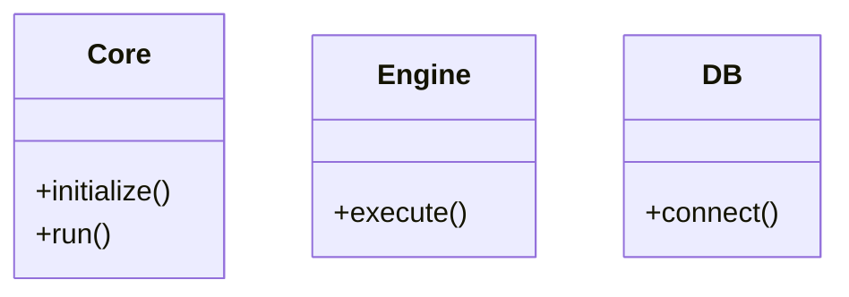

%%{init: { 'themeVariables': { 'subgraph': { 'theme': 'default' } } }}%%

### Diagram

### Notes

This diagram was updated to avoid parse errors caused by reserved keywords in Mermaid diagrams, specifically 'subgraph'.